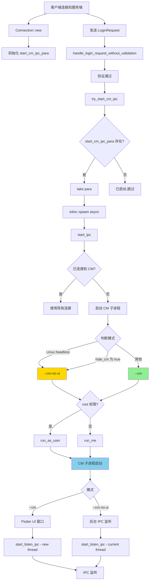

# CM (Connection Manager) 子进程启动位置分析

## 概述

本文档分析 RustDesk 中所有启动 CM (Connection Manager) 子进程的位置、触发条件和机制。

CM 有两种模式：
- **`--cm`**: 带 UI 的连接管理器（Flutter 窗口）
- **`--cm-no-ui`**: 无 UI 的连接管理器（后台运行）

---

## 1. CM 子进程启动入口

### 1.1 唯一的 CM 启动函数

**文件**: `src/server/connection.rs:4324-4424`

```rust
async fn start_ipc(
    mut rx_to_cm: mpsc::UnboundedReceiver<ipc::Data>,
    tx_from_cm: mpsc::UnboundedSender<ipc::Data>,
    mut _rx_desktop_ready: mpsc::Receiver<()>,
    tx_stream_ready: mpsc::Sender<()>,
) -> ResultType<()>
```

**功能**:
- 这是**唯一**启动 CM 子进程的函数
- 决定使用 `--cm` 还是 `--cm-no-ui`
- 处理 root 权限下的用户切换（Linux）
- 管理 IPC 连接

### 1.2 核心决策逻辑 (connection.rs:4344-4382)

```rust
let mut args = vec!["--cm"];  // 默认带 UI

// 判断是否使用 --cm-no-ui
#[cfg(target_os = "linux")]
let is_headless = crate::platform::is_headless_allowed()
    && linux_desktop_manager::is_headless();
#[cfg(not(target_os = "linux"))]
let is_headless = false;

let use_no_ui = is_headless || hbb_common::password_security::hide_cm();

if use_no_ui {
    args = vec!["--cm-no-ui"];
    log::info!("[CM] Starting connection manager in no-ui mode (hide_cm or headless)");

    // Linux headless: 等待桌面会话准备，以特定用户运行
    #[cfg(target_os = "linux")]
    if crate::platform::is_headless_allowed() && linux_desktop_manager::is_headless() {
        // ... 用户配置逻辑
    }
}
```

**决策条件**:
1. ✅ **Linux headless**: `is_headless_allowed() && is_headless()`
2. ✅ **hide_cm()**: 无人值守模式或配置隐藏 CM
   - 位置: `hbb_common::password_security::hide_cm()`
   - 检查: `Config::get_option("access-mode") == "view"` (仅查看模式)
   - 或其他隐藏 CM 的配置

**结果**:
- 满足任一条件 → 使用 `--cm-no-ui`
- 都不满足 → 使用 `--cm`

---

## 2. CM 子进程启动方式

### 2.1 Root 权限下 (connection.rs:4384-4410)

```rust
if crate::platform::is_root() {
    let mut res = Ok(None);
    for _ in 0..10 {
        #[cfg(not(any(target_os = "linux")))]
        {
            log::debug!("Start cm");
            res = crate::platform::run_as_user(args.clone());
        }
        #[cfg(target_os = "linux")]
        {
            log::debug!("Start cm");
            res = crate::platform::run_as_user(
                args.clone(),
                user.clone(),  // (uid, username)
                None::<(&str, &str)>,
            );
        }
        if res.is_ok() {
            break;
        }
        log::error!("Failed to run cm: {res:?}");
        sleep(1.).await;
    }
    if let Some(task) = res? {
        super::CHILD_PROCESS.lock().unwrap().push(task);
    }
    run_done = true;
}
```

**平台差异**:
- **Windows/macOS**: `run_as_user(args)` - 以当前登录用户运行
- **Linux**: `run_as_user(args, user, None)` - 以指定用户运行 (headless 模式)

### 2.2 非 Root 权限下 (connection.rs:4414-4420)

```rust
if !run_done {
    log::debug!("Start cm");
    super::CHILD_PROCESS
        .lock()
        .unwrap()
        .push(crate::run_me(args)?);
}
```

**说明**:
- 直接使用 `run_me(args)` 启动子进程
- 子进程继承当前用户权限

---

## 3. CM 启动触发位置

### 3.1 Connection 对象创建时初始化 (connection.rs:445-450)

```rust
pub fn new(
    // ... 参数
) -> Self {
    // ...
    Connection {
        // ...
        #[cfg(not(any(target_os = "android", target_os = "ios")))]
        start_cm_ipc_para: Some(StartCmIpcPara {
            rx_to_cm,
            tx_from_cm,
            rx_desktop_ready,
            tx_cm_stream_ready,
        }),
        // ...
    }
}
```

**说明**:
- 创建 `Connection` 时，初始化 IPC 通道参数
- 参数保存在 `start_cm_ipc_para` 字段中

### 3.2 登录请求处理后触发 (connection.rs:2127)

```rust
async fn handle_login_request_without_validation(&mut self, lr: &LoginRequest) {
    // ... 验证逻辑

    #[cfg(not(any(target_os = "android", target_os = "ios")))]
    self.try_start_cm_ipc();  // ← 启动 CM 子进程

    // ...
}
```

**触发时机**:
- 客户端发送登录请求后
- 通过验证（密码正确、2FA通过等）
- 调用 `handle_login_request_without_validation()`

### 3.3 `try_start_cm_ipc()` 函数 (connection.rs:1969-1990)

```rust
#[cfg(not(any(target_os = "android", target_os = "ios")))]
fn try_start_cm_ipc(&mut self) {
    if let Some(p) = self.start_cm_ipc_para.take() {
        tokio::spawn(async move {
            #[cfg(windows)]
            let tx_from_cm_clone = p.tx_from_cm.clone();
            if let Err(err) = start_ipc(
                p.rx_to_cm,
                p.tx_from_cm,
                p.rx_desktop_ready,
                p.tx_cm_stream_ready,
            )
            .await
            {
                log::error!("ipc to connection manager exit: {}", err);
            }
            // ...
        });
    }
}
```

**关键点**:
1. ✅ 调用一次后，`start_cm_ipc_para` 被 `take()` 移走
2. ✅ 确保每个 `Connection` 只启动一次 CM
3. ✅ 在独立的 tokio task 中运行 `start_ipc()`

---

## 4. 所有调用 `try_start_cm_ipc()` 的位置

### 4.1 正常登录流程

**位置**: `connection.rs:2127`

```rust
async fn handle_login_request_without_validation(&mut self, lr: &LoginRequest) {
    // ...
    #[cfg(not(any(target_os = "android", target_os = "ios")))]
    self.try_start_cm_ipc();
    // ...
}
```

**触发场景**:
- 客户端连接到服务端
- 发送登录请求
- 验证通过后调用

---

### 4.2 Switch 模式 (connection.rs:2300)

**位置**: `connection.rs:2300`

```rust
async fn handle_test_delay(&mut self, t: TestDelay) {
    // ...
    if let Some(lr) = self.lr_switches.remove(t.from_support.as_str()) {
        // ...
        self.from_switch = true;
        self.send_logon_response().await;
        self.try_start_cm(
            lr.my_id.clone(),
            lr.my_name.clone(),
            self.authorized,
        );
        #[cfg(not(any(target_os = "android", target_os = "ios")))]
        self.try_start_cm_ipc();  // ← 启动 CM
    }
    // ...
}
```

**触发场景**:
- 客户端从一个连接切换到另一个连接
- 例如：从支持模式切换到控制模式
- 需要重新初始化 CM

---

## 5. CM 子进程的两种模式

### 5.1 `--cm` 模式 (带 UI)

**入口**: `src/core_main.rs:705-708`

```rust
else if args[0] == "--cm" {
    // call connection manager to establish connections
    // meanwhile, return true to call flutter window to show control panel
    crate::ui_interface::start_option_status_sync();
}
```

**流程**:
1. 启动 Flutter 窗口
2. 显示连接管理器 UI
3. 用户可以看到连接状态、接受/拒绝连接等

**Sciter UI (旧版)**: `src/ui.rs:116-124`

```rust
else if args[0] == "--cm" {
    frame.register_behavior("connection-manager", move || {
        Box::new(cm::SciterConnectionManager::new())
    });
    page = "cm.html";
    *cm::HIDE_CM.lock().unwrap() = crate::ipc::get_config("hide_cm")
        .ok()
        .flatten()
        .unwrap_or_default()
        .parse::<bool>()
        .unwrap_or_default();
}
```

---

### 5.2 `--cm-no-ui` 模式 (无 UI)

**入口**: `src/core_main.rs:709-716`

```rust
else if args[0] == "--cm-no-ui" {
    #[cfg(feature = "flutter")]
    #[cfg(not(any(target_os = "android", target_os = "ios")))]
    {
        crate::ui_interface::start_option_status_sync();
        crate::flutter::connection_manager::start_cm_no_ui();
    }
    return None;
}
```

**`start_cm_no_ui()` 实现**: `src/flutter.rs:1565-1567`

```rust
pub fn start_cm_no_ui() {
    start_listen_ipc(false);  // 不创建新线程，直接在当前线程运行
}
```

**`start_listen_ipc()` 实现**: `src/flutter.rs:1576-1590`

```rust
fn start_listen_ipc(new_thread: bool) {
    use crate::ui_cm_interface::{start_ipc, ConnectionManager};

    #[cfg(target_os = "linux")]
    std::thread::spawn(crate::ipc::start_pa);

    let cm = ConnectionManager {
        ui_handler: FlutterHandler {},
    };
    if new_thread {
        std::thread::spawn(move || start_ipc(cm));
    } else {
        start_ipc(cm);  // --cm-no-ui: 直接在当前线程运行
    }
}
```

**关键区别**:
- `--cm`: 创建 Flutter UI 窗口 + IPC 监听
- `--cm-no-ui`: 仅 IPC 监听，无 UI 窗口
- 两者都使用 `ui_cm_interface::start_ipc()`，处理相同的 IPC 消息

---

## 6. IPC 消息处理

### 6.1 服务端发送的 IPC 消息

**位置**: `connection.rs:1752-1762`

```rust
fn try_start_cm(&mut self, peer_id: String, name: String, authorized: bool) {
    self.send_to_cm(ipc::Data::Login {
        id: self.inner.id(),
        is_file_transfer: self.file_transfer.is_some(),
        is_view_camera: self.view_camera,
        is_terminal: self.terminal,
        port_forward: self.port_forward.clone(),
        peer_id,
        name,
        authorized,
        keyboard: self.keyboard,
        clipboard: self.clipboard,
        audio: self.audio,
        file: self.file,
        restart: self.restart,
        recording: self.recording,
        from_switch: self.from_switch,
    });
}
```

**说明**:
- `try_start_cm()` 发送 `ipc::Data::Login` 消息到 CM
- CM 子进程通过 IPC 接收并显示连接信息

### 6.2 CM 接收 IPC 消息

**位置**: `src/ui_cm_interface.rs:638-670`

```rust
pub async fn start_ipc<T: InvokeUiCM>(cm: ConnectionManager<T>) {
    loop {
        match stream.next().await {
            Some(Ok(data)) => {
                match data {
                    ipc::Data::Login { /* ... */ } => {
                        // 处理登录消息
                        cm.ui_handler.new_connection(/* ... */);
                    }
                    ipc::Data::Close { id } => {
                        // 处理关闭消息
                        cm.ui_handler.close_connection(id);
                    }
                    // ... 其他消息
                }
            }
            // ...
        }
    }
}
```

---

## 7. CM 启动流程图



---

## 8. 所有启动 CM 的位置汇总

| 序号 | 文件:行号 | 函数 | 触发场景 | 模式决策 |
|------|-----------|------|----------|----------|
| 1 | `connection.rs:2127` | `handle_login_request_without_validation` | 正常登录 | `hide_cm()` 或 `is_headless` |
| 2 | `connection.rs:2300` | `handle_test_delay` | Switch 模式切换 | 同上 |

**说明**:
- 两个位置都调用同一个函数: `try_start_cm_ipc()`
- `try_start_cm_ipc()` 调用 `start_ipc()` 启动 CM 子进程
- **`start_ipc()` 是唯一的 CM 启动函数**

---

## 9. CM 模式决策逻辑

### 9.1 决策函数

**文件**: `src/server/connection.rs:4349-4358`

```rust
// Determine whether to use --cm-no-ui or --cm
// Priority: 1. Linux headless  2. hide cm
#[cfg(target_os = "linux")]
let is_headless = crate::platform::is_headless_allowed()
    && linux_desktop_manager::is_headless();
#[cfg(not(target_os = "linux"))]
let is_headless = false;

let use_no_ui = is_headless || hbb_common::password_security::hide_cm();
if use_no_ui {
    args = vec!["--cm-no-ui"];
    log::info!("[CM] Starting connection manager in no-ui mode (hide_cm or headless)");
}
```

### 9.2 `hide_cm()` 实现

**文件**: `hbb_common/src/password_security.rs` (推测)

```rust
pub fn hide_cm() -> bool {
    // 检查无人值守模式
    // 检查配置 access-mode == "view"
    // 或其他隐藏 CM 的条件
}
```

**触发条件** (推测):
1. ✅ 配置了无人值守访问模式 (`access-mode = "view"`)
2. ✅ 配置选项 `hide_cm = true`
3. ✅ 其他需要隐藏 CM 的场景

---

## 10. 平台差异

### 10.1 Linux 特有行为

#### Headless 模式检测

```rust
#[cfg(target_os = "linux")]
let is_headless = crate::platform::is_headless_allowed()
    && linux_desktop_manager::is_headless();
```

**说明**:
- Linux 可能运行在无头环境（无图形界面）
- 需要启动 `--cm-no-ui` 以避免创建窗口

#### 用户切换

```rust
#[cfg(target_os = "linux")]
if crate::platform::is_headless_allowed() && linux_desktop_manager::is_headless() {
    let mut username = linux_desktop_manager::get_username();
    loop {
        if !username.is_empty() {
            break;
        }
        let _res = timeout(1_000, _rx_desktop_ready.recv()).await;
        username = linux_desktop_manager::get_username();
    }
    let uid = {
        let output = run_cmds(&format!("id -u {}", &username))?;
        // ...
    };
    user = Some((uid, username));
}
```

**说明**:
- Headless 模式下，等待桌面会话准备
- 获取用户 UID 和用户名
- CM 以指定用户运行（而非 root）

#### PulseAudio

```rust
#[cfg(target_os = "linux")]
std::thread::spawn(crate::ipc::start_pa);
```

**说明**:
- Linux 启动 PulseAudio 服务
- 用于音频传输

---

### 10.2 Windows/macOS 行为

#### 无 Headless 检测

```rust
#[cfg(not(target_os = "linux"))]
let is_headless = false;
```

**说明**:
- Windows/macOS 默认不检测 headless
- 仅通过 `hide_cm()` 决定是否使用 `--cm-no-ui`

#### Root 权限处理

```rust
#[cfg(not(any(target_os = "linux")))]
{
    log::debug!("Start cm");
    res = crate::platform::run_as_user(args.clone());
}
```

**说明**:
- Windows: 以当前登录用户运行（通过 Token 切换）
- macOS: 类似机制

---

## 11. 关键配置项

### 11.1 `hide_cm`

**来源**: `Config::get_option("hide_cm")` 或 `password_security::hide_cm()`

**作用**:
- 控制是否使用 `--cm-no-ui` 模式
- 无人值守模式通常启用此选项

### 11.2 `access-mode`

**值**: `"view"` (仅查看) 或其他

**作用**:
- `view` 模式通常隐藏 CM
- 防止用户看到连接通知窗口

---

## 12. CM 子进程生命周期

### 12.1 启动

```rust
super::CHILD_PROCESS.lock().unwrap().push(task);
```

**说明**:
- CM 子进程添加到 `CHILD_PROCESS` 全局列表
- 服务端进程负责管理子进程生命周期

### 12.2 IPC 连接

```rust
for _ in 0..20 {
    sleep(0.3).await;
    if let Ok(s) = crate::ipc::connect(1000, "_cm").await {
        stream = Some(s);
        break;
    }
}
```

**说明**:
- 启动后轮询等待 CM 进程准备就绪
- 最多等待 6 秒（20 × 0.3）
- 通过 IPC 连接 `_cm` 通道

### 12.3 消息传递

```rust
fn send_to_cm(&mut self, data: ipc::Data) {
    self.tx_to_cm.send(data).ok();
}
```

**说明**:
- 服务端通过 `tx_to_cm` 发送消息
- CM 通过 `rx_to_cm` 接收消息
- 双向通信实现状态同步

### 12.4 退出

**CM 子进程在以下情况退出**:
1. ✅ 服务端进程退出（子进程自动终止）
2. ✅ IPC 连接断开
3. ✅ CM 主动退出（用户关闭窗口）

---

## 13. 常见问题

### 13.1 为什么有时看到 CM 窗口，有时看不到？

**原因**:
- 看到窗口：使用 `--cm` 模式
- 看不到窗口：使用 `--cm-no-ui` 模式

**触发条件**:
- Linux headless: 一定使用 `--cm-no-ui`
- 无人值守模式 (`hide_cm()` 为 true): 使用 `--cm-no-ui`
- 其他情况: 使用 `--cm`

---

### 13.2 为什么 `try_start_cm_ipc()` 只调用一次？

**原因**:
- `start_cm_ipc_para` 被 `take()` 移走后变为 `None`
- 第二次调用时，`if let Some(p) = ...` 条件不成立
- 确保每个连接只启动一次 CM

**设计目的**:
- 避免多次启动 CM 子进程
- CM 是全局共享的，所有连接使用同一个 CM

---

### 13.3 Switch 模式为什么需要再次调用？

**原因**:
- Switch 从一个连接切换到另一个连接
- 新连接可能需要不同的权限或状态

**但实际上**:
- `try_start_cm_ipc()` 只执行一次
- 第二次调用被忽略（`start_cm_ipc_para` 已被 `take()`）
- 这可能是一个冗余调用

---

### 13.4 如何判断当前进程是 CM 进程？

**方法**: 检查 `IS_CM` 全局变量

**定义**: `src/common.rs:93`

```rust
static ref IS_CM: bool =
    std::env::args().nth(1) == Some("--cm".to_owned())
    || std::env::args().nth(1) == Some("--cm-no-ui".to_owned());
```

**用法**:
```rust
if *crate::IS_CM {
    // CM 进程特有逻辑
}
```

---

## 14. 总结

### 14.1 CM 启动路径

```
客户端连接
  └─> Connection::new() (初始化 IPC 通道)
      └─> handle_login_request_without_validation()
          └─> try_start_cm_ipc()
              └─> tokio::spawn(start_ipc())
                  └─> 判断是否已连接 CM
                      ├─> 是: 使用现有连接
                      └─> 否: 启动 CM 子进程
                          ├─> hide_cm() 或 is_headless → --cm-no-ui
                          └─> 其他 → --cm
```

### 14.2 关键设计

1. **唯一启动点**: `start_ipc()` 是唯一启动 CM 的函数
2. **单次启动**: `try_start_cm_ipc()` 通过 `take()` 确保只执行一次
3. **模式自动选择**: 根据 `hide_cm()` 和 `is_headless` 自动选择模式
4. **平台适配**: Linux 特殊处理 headless 和用户切换
5. **IPC 通信**: 服务端和 CM 通过 IPC 消息同步状态

### 14.3 两种模式对比

| 特性 | --cm | --cm-no-ui |
|------|------|------------|
| **UI 窗口** | ✅ Flutter 窗口 | ❌ 无窗口 |
| **IPC 监听** | ✅ 独立线程 | ✅ 当前线程 |
| **消息处理** | ✅ 完整实现 | ✅ 完整实现 |
| **用户可见** | ✅ 可见连接状态 | ❌ 后台运行 |
| **使用场景** | 普通模式 | 无人值守/headless |
| **资源消耗** | 高（UI 渲染） | 低（仅 IPC） |

### 14.4 启动位置汇总

| 启动位置 | 数量 |
|----------|------|
| **唯一启动函数** | `start_ipc()` @ connection.rs:4324 |
| **调用点** | `try_start_cm_ipc()` @ connection.rs:1969 |
| **触发场景** | 2 个位置（正常登录 + Switch 模式） |
| **模式决策** | `hide_cm()` + `is_headless` |
| **实际启动** | `run_as_user()` 或 `run_me()` |

---

**关键结论**:
- RustDesk 中只有 **一个** CM 启动函数: `start_ipc()`
- 通过 **两个** 触发点调用: 正常登录 + Switch 模式
- 但由于 `take()` 机制，实际每个 Connection **只启动一次** CM
- CM 模式由 `hide_cm()` 和 `is_headless` **自动决定**
