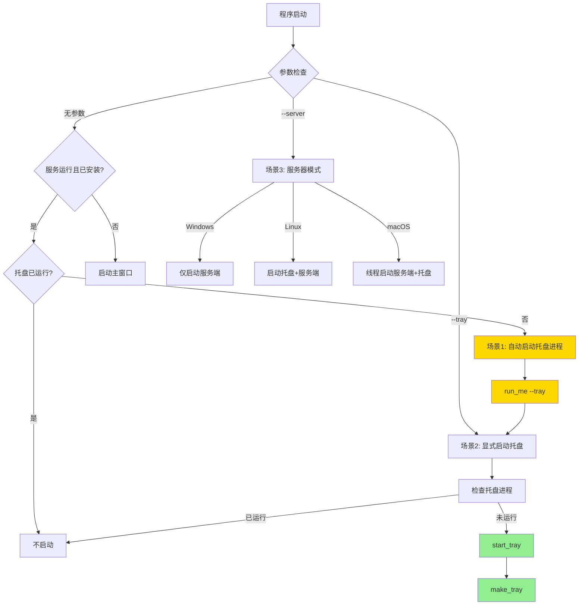
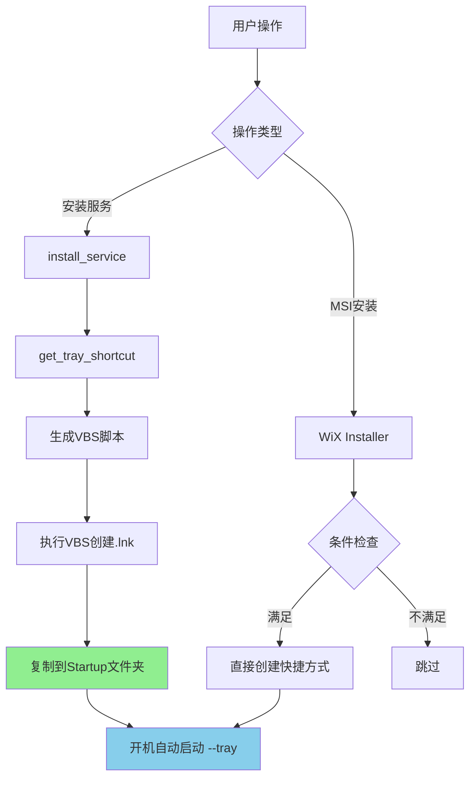

# Windows 版本 Tray (系统托盘) 启动位置分析

## 概述

本文档分析 Windows 版本 RustDesk 中所有启动系统托盘 (tray) 的位置、触发条件和机制。

## 1. Tray 启动入口

### 1.1 核心启动函数

**文件**: `src/tray.rs:11`

```rust
pub fn start_tray() {
    if crate::ui_interface::get_builtin_option(hbb_common::config::keys::OPTION_HIDE_TRAY) == "Y" {
        return;
    }
    allow_err!(make_tray());
}
```

**功能**:
- 检查 `OPTION_HIDE_TRAY` 配置项
- 如果配置为隐藏托盘，直接返回
- 否则调用 `make_tray()` 创建托盘图标

## 2. Tray 启动场景

### 2.1 场景一：程序无参数启动时自动启动 Tray

**文件**: `src/core_main.rs:89-103`

```rust
#[cfg(any(target_os = "linux", target_os = "windows"))]
if args.is_empty() {
    #[cfg(target_os = "windows")]
    let should_check_start_tray = crate::platform::is_self_service_running()
        && crate::platform::is_cur_exe_the_installed();

    if should_check_start_tray && !crate::check_process("--tray", true) {
        hbb_common::allow_err!(crate::run_me(vec!["--tray"]));
    }
}
```

**触发条件** (Windows):
1. ✅ 程序无参数启动 (`args.is_empty()`)
2. ✅ 系统服务正在运行 (`is_self_service_running()`)
3. ✅ 当前 exe 是安装版本 (`is_cur_exe_the_installed()`)
4. ✅ 没有其他 tray 进程运行 (`!check_process("--tray", true)`)

**动作**:
- 通过 `run_me(vec!["--tray"])` 启动新的托盘进程

**目的**:
- 当用户双击已安装的 RustDesk 且服务已运行时，自动显示托盘图标
- 避免启动主窗口，提供轻量级访问

---

### 2.2 场景二：显式使用 `--tray` 参数启动

**文件**: `src/core_main.rs:400-404`

```rust
else if args[0] == "--tray" {
    if !crate::check_process("--tray", true) {
        crate::tray::start_tray();
    }
    return None;
}
```

**触发条件**:
1. ✅ 命令行参数包含 `--tray`
2. ✅ 没有其他 tray 进程运行

**动作**:
- 直接调用 `start_tray()` 在当前进程启动托盘
- 函数返回 `None`，程序保持运行显示托盘

**使用场景**:
- 用户手动执行 `rustdesk.exe --tray`
- 开机启动快捷方式 (Startup 文件夹)
- 服务安装时创建的快捷方式

---

### 2.3 场景三：`--server` 模式启动 Tray (仅 Linux)

**文件**: `src/core_main.rs:435-460`

```rust
else if args[0] == "--server" {
    log::info!("start --server with user {}", crate::username());

    #[cfg(target_os = "linux")]
    {
        hbb_common::allow_err!(crate::platform::check_autostart_config());
        std::process::Command::new("pkill")
            .arg("-f")
            .arg(&format!("{} --tray", crate::get_app_name().to_lowercase()))
            .status()
            .ok();
        hbb_common::allow_err!(crate::run_me(vec!["--tray"]));
    }

    #[cfg(any(target_os = "linux", target_os = "windows"))]
    {
        crate::start_server(true, false);
    }

    #[cfg(target_os = "macos")]
    {
        let handler = std::thread::spawn(move || crate::start_server(true, false));
        crate::tray::start_tray();
        hbb_common::allow_err!(handler.join());
    }
    return None;
}
```

**Windows 行为**:
- ❌ Windows 不在 `--server` 模式启动 tray
- ✅ 仅启动服务端 (`start_server(true, false)`)

**Linux 行为**:
- ✅ 杀死已有的 tray 进程
- ✅ 通过 `run_me(vec!["--tray"])` 启动新的托盘进程

**macOS 行为**:
- ✅ 在单独线程启动服务端
- ✅ 在主线程直接启动托盘 (`start_tray()`)

---

## 3. 开机自启动机制 (Windows Startup)

### 3.1 安装服务时创建 Startup 快捷方式

**文件**: `src/platform/windows.rs:2681-2703`

```rust
pub fn install_service() -> bool {
    log::info!("Installing service...");
    let (_, _, _, exe) = get_install_info();
    let tmp_path = std::env::temp_dir().to_string_lossy().to_string();
    let tray_shortcut = get_tray_shortcut(&exe, &tmp_path).unwrap_or_default();

    let cmds = format!(
        "
chcp 65001
taskkill /F /IM {app_name}.exe{filter}
cscript \"{tray_shortcut}\"
copy /Y \"{tmp_path}\\{app_name} Tray.lnk\" \"%PROGRAMDATA%\\Microsoft\\Windows\\Start Menu\\Programs\\Startup\\\"
{import_config}
{create_service}
if exist \"{tray_shortcut}\" del /f /q \"{tray_shortcut}\"
    ",
        app_name = crate::get_app_name(),
        import_config = get_import_config(&exe),
        create_service = get_create_service(&exe),
    );

    run_cmds(cmds, false, "install");
    // ...
}
```

**步骤**:
1. ✅ 生成 VBS 脚本创建快捷方式 (`get_tray_shortcut()`)
2. ✅ 执行 VBS 脚本创建 `.lnk` 文件
3. ✅ 复制快捷方式到 Startup 文件夹:
   - 路径: `%PROGRAMDATA%\Microsoft\Windows\Start Menu\Programs\Startup\`
   - 文件名: `RustDesk Tray.lnk`
4. ✅ 快捷方式目标: `"<exe路径>" --tray`

**位置**:
- `src/platform/windows.rs:2695`
- `src/platform/windows.rs:1471` (update_me 函数)

---

### 3.2 创建 Tray 快捷方式的 VBS 脚本

**文件**: `src/platform/windows.rs:2894-2914`

```rust
pub fn get_tray_shortcut(exe: &str, tmp_path: &str) -> ResultType<String> {
    Ok(write_cmds(
        format!(
            "
Set oWS = WScript.CreateObject(\"WScript.Shell\")
sLinkFile = \"{tmp_path}\\{app_name} Tray.lnk\"

Set oLink = oWS.CreateShortcut(sLinkFile)
    oLink.TargetPath = \"{exe}\"
    oLink.Arguments = \"--tray\"
oLink.Save
        ",
            app_name = crate::get_app_name(),
        ),
        "vbs",
        "tray_shortcut",
    )?
    .to_str()
    .unwrap_or("")
    .to_owned())
}
```

**功能**:
- 在临时目录创建 VBS 脚本
- VBS 脚本创建快捷方式，参数为 `--tray`
- 返回 VBS 脚本路径

---

### 3.3 删除 Startup 快捷方式

**场景一：卸载服务时**

**文件**: `src/platform/windows.rs:1612`

```bat
if exist "%PROGRAMDATA%\\Microsoft\\Windows\\Start Menu\\Programs\\Startup\\{app_name} Tray.lnk" del /f /q "%PROGRAMDATA%\\Microsoft\\Windows\\Start Menu\\Programs\\Startup\\{app_name} Tray.lnk"
```

**场景二：创建服务时检测到 `stop-service` 配置**

**文件**: `src/platform/windows.rs:2937-2941`

```rust
fn get_create_service(exe: &str) -> String {
    if config::is_outgoing_only() {
        return "".to_string();
    }
    let stop = Config::get_option("stop-service") == "Y";
    if stop {
        format!("
if exist \"%PROGRAMDATA%\\Microsoft\\Windows\\Start Menu\\Programs\\Startup\\{app_name} Tray.lnk\" del /f /q \"%PROGRAMDATA%\\Microsoft\\Windows\\Start Menu\\Programs\\Startup\\{app_name} Tray.lnk\"
", app_name = crate::get_app_name())
    } else {
        // ... 创建服务代码
    }
}
```

**说明**:
- `stop-service` 配置项控制是否启动托盘
- 如果设置为 `Y`，删除 Startup 快捷方式，服务停止时不自动启动托盘

---

## 4. MSI 安装程序中的 Tray 配置

### 4.1 WiX 组件定义

**文件**: `res/msi/Package/Components/RustDesk.wxs:128-130`

```xml
<Component Id="App.StartupFolder.ShortcutTray" Guid="B1D1E2BB-E53E-E159-DB7C-744D5C726A8C"
           Condition="STARTUPSHORTCUTS = 1 AND (NOT CC_CONNECTION_TYPE=&quot;outgoing&quot;)">
    <Shortcut Id="App.StartupFolder.ShortcutTray"
              Name="!(loc.SC_Client_Tray)"
              Description="!(loc.SC_Client_Tray_Desc)"
              Target="[!App.exe]"
              Arguments="--tray"
              Icon="AppIcon"
              WorkingDirectory="INSTALLFOLDER_INNER" />
    <RegistryValue Root="HKCU"
                   Key="Software\$(var.Product)"
                   Name="App.StartupFolder.ShortcutTray"
                   Type="string"
                   Value="1"
                   KeyPath="yes" />
</Component>
```

**安装条件**:
1. ✅ `STARTUPSHORTCUTS = 1` (用户选择安装开机启动)
2. ✅ `NOT CC_CONNECTION_TYPE="outgoing"` (不是仅外连模式)

**快捷方式参数**:
- Target: 安装的 exe 路径
- Arguments: `--tray`

---

### 4.2 本地化字符串

**文件**: `res/msi/Package/Language/Package.en-us.wxl:33`

```xml
<String Id="SC_Client_Tray_Desc" Value="Start RustDesk tray." />
```

---

## 5. 启动流程总结

### 5.1 完整启动路径



### 5.2 Startup 快捷方式创建路径



---

## 6. 关键配置项

### 6.1 `OPTION_HIDE_TRAY`

**位置**: `hbb_common::config::keys::OPTION_HIDE_TRAY`

**作用**:
- 控制是否显示托盘图标
- 值为 `"Y"` 时，`start_tray()` 直接返回

### 6.2 `stop-service`

**位置**: `Config::get_option("stop-service")`

**作用**:
- 控制服务停止时是否保留托盘自启动
- 值为 `"Y"` 时，删除 Startup 快捷方式

### 6.3 `is_outgoing_only()`

**位置**: `config::is_outgoing_only()`

**作用**:
- 检测是否为仅外连模式
- 仅外连模式不创建托盘快捷方式

---

## 7. Windows 特有行为

### 7.1 进程检测限制

**代码**: `src/core_main.rs:93-98`

```rust
// We can use `crate::check_process("--server", false)` on Windows.
// Because `--server` process is the System user's process. We can't get the arguments in `check_process()`.
// We can assume that self service running means the server is also running on Windows.
#[cfg(target_os = "windows")]
let should_check_start_tray = crate::platform::is_self_service_running()
    && crate::platform::is_cur_exe_the_installed();
```

**原因**:
- Windows 服务以 System 用户运行
- 普通用户进程无法获取 System 用户进程的命令行参数
- 因此通过检测服务状态 (`is_self_service_running()`) 代替进程检测

### 7.2 不在 `--server` 模式启动 Tray

**Linux/macOS**:
- `--server` 会启动托盘

**Windows**:
- ❌ `--server` **不启动托盘**
- ✅ 仅启动服务端监听

**原因**:
- Windows 通过服务 (`--service`) 运行服务端
- 托盘通过 Startup 快捷方式独立启动
- 分离更清晰，避免权限问题

---

## 8. 所有启动 Tray 的位置汇总

| 序号 | 文件:行号 | 触发条件 | 方式 | 平台 |
|------|-----------|----------|------|------|
| 1 | `core_main.rs:102` | 无参数启动 + 服务运行 + 已安装 + 托盘未运行 | `run_me(["--tray"])` | Windows, Linux |
| 2 | `core_main.rs:402` | 命令行 `--tray` + 托盘未运行 | `start_tray()` | All |
| 3 | `core_main.rs:445` | 命令行 `--server` | `run_me(["--tray"])` | Linux only |
| 4 | `core_main.rs:456` | 命令行 `--server` | `start_tray()` | macOS only |
| 5 | `windows.rs:2695` | `install_service()` | 创建 Startup 快捷方式 | Windows |
| 6 | `windows.rs:1471` | `update_me()` | 创建 Startup 快捷方式 | Windows |
| 7 | `RustDesk.wxs:129` | MSI 安装 | 创建 Startup 快捷方式 | Windows |

---

## 9. 重要函数调用链

### 9.1 直接启动托盘

```
rustdesk.exe --tray
  └─> core_main.rs:main()
      └─> core_main.rs:400-404
          └─> tray.rs:start_tray()
              └─> tray.rs:make_tray()
                  └─> 创建托盘图标和菜单
```

### 9.2 自动启动托盘 (无参数)

```
rustdesk.exe (无参数)
  └─> core_main.rs:main()
      └─> core_main.rs:89-103
          └─> 检测: is_self_service_running() && is_cur_exe_the_installed()
              └─> run_me(vec!["--tray"])
                  └─> 启动新进程: rustdesk.exe --tray
                      └─> (回到 9.1 流程)
```

### 9.3 服务安装创建开机自启动

```
rustdesk.exe --install-service
  └─> core_main.rs:405-410
      └─> platform::install_service()
          └─> windows.rs:2681-2703
              └─> get_tray_shortcut() (2894-2914)
                  └─> 生成 VBS 脚本
              └─> 执行: cscript "tray_shortcut.vbs"
                  └─> 创建: %TEMP%\RustDesk Tray.lnk
              └─> 执行: copy "RustDesk Tray.lnk" to Startup folder
                  └─> 目标: %PROGRAMDATA%\...\Startup\RustDesk Tray.lnk
```

---

## 10. 相关问题和注意事项

### 10.1 托盘重复启动预防

- 所有启动点都会调用 `check_process("--tray", true)`
- 确保同一时间只有一个托盘进程运行

### 10.2 服务停止后托盘行为

- 场景 1 (无参数启动) 会检测服务状态
- 如果服务未运行，不会自动启动托盘
- 但 Startup 快捷方式仍会在开机时启动托盘

### 10.3 升级时的处理

**文件**: `res/msi/CustomActions/CustomActions.cpp:501`

```cpp
// Steps to reproduce: Install -> stop service in tray --> start service -> upgrade
```

**问题**:
- 升级时可能需要重新创建 Startup 快捷方式
- 需要处理服务状态变化

---

## 11. 总结

Windows 版本 RustDesk 的托盘启动机制包含：

1. **直接启动** (`--tray` 参数)
2. **自动启动** (无参数 + 服务运行)
3. **开机自启动** (Startup 快捷方式)
4. **安装程序创建** (MSI WiX 组件)

核心设计原则：
- ✅ 避免重复启动 (进程检测)
- ✅ 尊重用户配置 (OPTION_HIDE_TRAY)
- ✅ 分离服务和托盘 (Windows 特有)
- ✅ 支持开机自启动 (Startup 文件夹)
