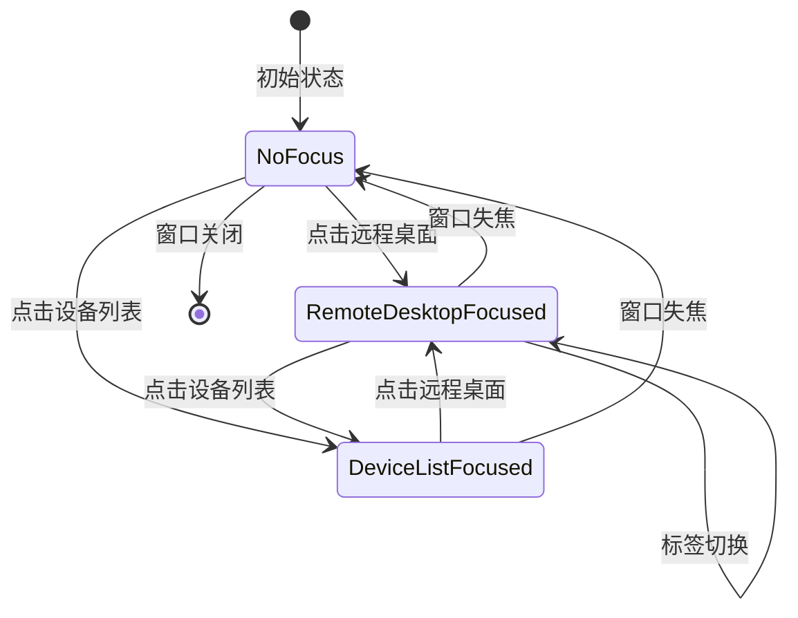
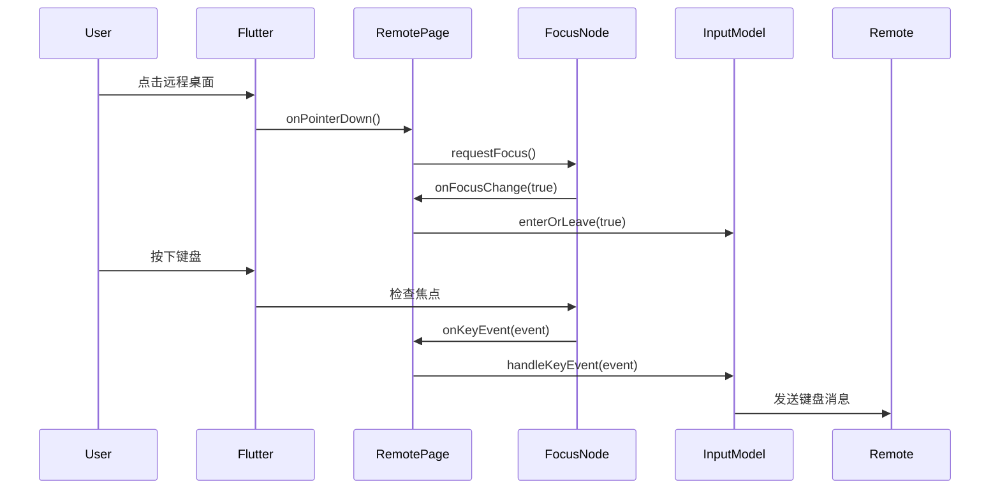

# 设备管理窗口 - 按键事件流分析

## 文档信息

- **创建日期**: 2025-10-26
- **版本**: 1.0
- **作者**: Claude Code
- **相关功能**: 设备管理窗口远程桌面键盘输入

## 目录

1. [概述](#概述)
2. [组件层次结构](#组件层次结构)
3. [按键事件传递路径](#按键事件传递路径)
4. [焦点管理机制](#焦点管理机制)
5. [问题分析与修复](#问题分析与修复)
6. [验证方法](#验证方法)
7. [相关文件](#相关文件)

---

## 概述

设备管理窗口 (`DesktopDeviceManagementPage`) 是一个集成了设备列表和远程桌面的复合页面。本文档深入分析了按键事件在此页面中的传递路径，以及焦点管理机制。

### 关键特性

- 上下分栏布局（远程桌面 + 设备列表）
- 多标签远程桌面连接（最多 8 个标签）
- 统一的键盘输入处理
- 焦点隔离机制

---

## 组件层次结构

### 1. 完整的 Widget 树

```
DesktopDeviceManagementPage (StatefulWidget)
│
└── Scaffold
    └── Column
        ├── Expanded (远程桌面区域)
        │   └── DesktopTab
        │       └── Obx
        │           └── PageView
        │               ├── physics: NeverScrollableScrollPhysics
        │               └── children: List<RemotePage>
        │                   └── RemotePage (per tab)
        │                       ├── Container (kColorCanvas)
        │                       └── RawKeyFocusScope ← 键盘事件入口
        │                           ├── FocusScope (autofocus: false)
        │                           └── Focus
        │                               ├── focusNode: _rawKeyFocusNode
        │                               ├── onFocusChange: callback
        │                               ├── onKeyEvent: handleKeyEvent
        │                               └── child: getBodyForDesktop()
        │                                   └── RawTouchGestureDetectorRegion
        │                                       └── ImagePaint (远程桌面画面)
        │
        └── DeviceListPanel (固定高度)
            └── FocusScope ← 焦点隔离
                ├── canRequestFocus: _expanded
                ├── skipTraversal: true
                └── Column
                    ├── DraggableDivider (thickness: 2.0)
                    └── AnimatedContainer
                        ├── _buildPanelHeader()
                        │   └── TextField (autofocus: false)
                        └── _buildDeviceTable()
```

### 2. 核心组件说明

#### DesktopDeviceManagementPage
- **文件**: `flutter/lib/desktop/pages/desktop_device_management_page.dart`
- **职责**: 管理整体布局和标签控制器
- **关键属性**:
  - `remoteTabController`: DesktopTabController (tabType: main)
  - `maxTabs`: 8

#### DesktopTab
- **文件**: `flutter/lib/desktop/widgets/tabbar_widget.dart`
- **职责**: 标签栏和页面切换管理
- **关键属性**:
  - `state`: DesktopTabState (包含 tabs 和 pageController)
  - `pageController`: PageController

#### RemotePage
- **文件**: `flutter/lib/desktop/pages/remote_page.dart`
- **职责**: 单个远程桌面连接的渲染和交互
- **关键属性**:
  - `_rawKeyFocusNode`: FocusNode (接收键盘事件)
  - `_ffi`: FFI (与 Rust 后端通信)
  - `_isWindowBlur`: bool (窗口焦点状态)

#### RawKeyFocusScope
- **文件**: `flutter/lib/common/widgets/remote_input.dart`
- **职责**: 键盘事件捕获和处理
- **关键特性**:
  - `autofocus: false` (避免自动焦点冲突)
  - `onKeyEvent`: 调用 `inputModel.handleKeyEvent()`

#### DeviceListPanel
- **文件**: `flutter/lib/desktop/widgets/device_list_panel.dart`
- **职责**: 设备列表显示和交互
- **焦点隔离**:
  - `FocusScope.canRequestFocus: _expanded`
  - `FocusScope.skipTraversal: true`
  - `TextField.autofocus: false`

---

## 按键事件传递路径

### 1. 正常事件流（Windows 平台）

```
┌─────────────────────────────────────────────────────────────┐
│ 1. 操作系统 (Windows)                                        │
│    - 用户按下键盘                                             │
│    - Windows 生成 KeyEvent                                   │
└─────────────────────────────────────────────────────────────┘
                           ↓
┌─────────────────────────────────────────────────────────────┐
│ 2. Flutter Engine                                            │
│    - 接收原生键盘事件                                         │
│    - 转换为 Flutter KeyEvent                                 │
└─────────────────────────────────────────────────────────────┘
                           ↓
┌─────────────────────────────────────────────────────────────┐
│ 3. Flutter Focus System                                      │
│    - 查找当前焦点节点                                         │
│    - 检查 FocusNode.hasFocus                                 │
└─────────────────────────────────────────────────────────────┘
                           ↓
┌─────────────────────────────────────────────────────────────┐
│ 4. _rawKeyFocusNode (RemotePage)                            │
│    - 如果 hasFocus == true，接收事件                         │
│    - 触发 Focus.onKeyEvent 回调                              │
└─────────────────────────────────────────────────────────────┘
                           ↓
┌─────────────────────────────────────────────────────────────┐
│ 5. RawKeyFocusScope.onKeyEvent                              │
│    - 调用 inputModel.handleKeyEvent(event)                   │
│    - 处理按键事件                                             │
└─────────────────────────────────────────────────────────────┘
                           ↓
┌─────────────────────────────────────────────────────────────┐
│ 6. InputModel (Rust FFI)                                     │
│    - 将键盘事件转换为远程协议消息                             │
│    - 通过网络发送到远程主机                                   │
└─────────────────────────────────────────────────────────────┘
                           ↓
┌─────────────────────────────────────────────────────────────┐
│ 7. 远程主机                                                  │
│    - 接收键盘事件消息                                         │
│    - 模拟键盘输入                                             │
└─────────────────────────────────────────────────────────────┘
```

### 2. 关键代码位置

#### 2.1 焦点请求 (RemotePage.enterView)
**文件**: `flutter/lib/desktop/pages/remote_page.dart:420-428`

```dart
void enterView() {
  // Request focus on all platforms including Windows
  if (!_rawKeyFocusNode.hasFocus) {
    debugPrint('enterView: requesting focus for remote desktop');
    _rawKeyFocusNode.requestFocus();
  }
  _ffi.inputModel.enterOrLeave(true);
}
```

**调用时机**:
- PageView 切换到当前页面时
- 用户点击远程桌面区域时

#### 2.2 键盘事件处理 (RawKeyFocusScope)
**文件**: `flutter/lib/common/widgets/remote_input.dart:30-52`

```dart
@override
Widget build(BuildContext context) {
  final useRawKeyEvents = isLinux && !isWeb;

  return FocusScope(
      autofocus: false,  // 避免焦点冲突
      child: Focus(
          autofocus: false,  // 依赖手动请求焦点
          canRequestFocus: true,
          focusNode: focusNode,
          onFocusChange: onFocusChange,
          onKeyEvent: useRawKeyEvents
              ? null
              : (FocusNode node, KeyEvent event) =>
                  inputModel.handleKeyEvent(event),
          child: child
      )
  );
}
```

#### 2.3 焦点变化回调 (RemotePage.onFocusChange)
**文件**: `flutter/lib/desktop/pages/remote_page.dart:308-325`

```dart
onFocusChange: (bool imageFocused) {
  debugPrint("onFocusChange(window active:${!_isWindowBlur}) $imageFocused");

  // Windows 平台特殊处理
  if (isWindows) {
    if (_isWindowBlur) {
      // 窗口失焦时，强制取消焦点
      imageFocused = false;
      Future.delayed(Duration.zero, () {
        _rawKeyFocusNode.unfocus();
      });
    }

    if (imageFocused) {
      _ffi.inputModel.enterOrLeave(true);
    } else {
      _ffi.inputModel.enterOrLeave(false);
    }
  }
}
```

---

## 焦点管理机制

### 1. 焦点层次结构

```
Window (全局焦点)
│
├── DesktopTab (主焦点域)
│   └── PageView
│       └── RemotePage (当前页面)
│           └── RawKeyFocusScope
│               └── Focus (_rawKeyFocusNode) ← 接收键盘事件
│
└── DeviceListPanel (隔离焦点域)
    └── FocusScope (skipTraversal: true)
        └── TextField (autofocus: false)
```

### 2. 焦点隔离策略

#### 2.1 远程桌面区域
- **策略**: 手动焦点管理
- **特点**:
  - `autofocus: false` - 不自动获取焦点
  - 通过 `_rawKeyFocusNode.requestFocus()` 手动请求
  - 在 `enterView()` 和 `onPointerDown()` 时请求焦点

#### 2.2 设备列表区域
- **策略**: 焦点隔离
- **特点**:
  - `FocusScope.canRequestFocus: _expanded` - 只在展开时允许焦点
  - `FocusScope.skipTraversal: true` - 跳过焦点遍历
  - `TextField.autofocus: false` - 不自动获取焦点

### 3. 焦点切换流程

```mermaid
graph TD
    A[用户操作] --> B{操作类型}
    B -->|点击远程桌面| C[RemotePage.onPointerDown]
    B -->|点击设备列表| D[DeviceListPanel]
    B -->|PageView切换| E[RemotePage.enterView]

    C --> F[_rawKeyFocusNode.requestFocus]
    D --> G[TextField获取焦点]
    E --> F

    F --> H[onFocusChange: true]
    G --> I[onFocusChange: false]

    H --> J[inputModel.enterOrLeave(true)]
    I --> K[inputModel.enterOrLeave(false)]
```

---

## 问题分析与修复

### 问题 1: Windows 平台焦点请求被阻塞

#### 原因分析
**文件**: `flutter/lib/desktop/pages/remote_page.dart:421` (修复前)

```dart
// 问题代码
if (!isWindows) {  // ← 阻塞了 Windows 平台
  if (!_rawKeyFocusNode.hasFocus) {
    _rawKeyFocusNode.requestFocus();
  }
}
```

这段代码原本是为了处理 Linux/macOS 平台的焦点问题，但意外地阻止了 Windows 平台的焦点请求。

#### 修复方案
移除平台判断，允许所有平台手动请求焦点：

```dart
// 修复后
if (!_rawKeyFocusNode.hasFocus) {
  debugPrint('enterView: requesting focus for remote desktop');
  _rawKeyFocusNode.requestFocus();
}
_ffi.inputModel.enterOrLeave(true);
```

#### 影响
- ✅ Windows 平台可以正常请求焦点
- ✅ 其他平台不受影响

---

### 问题 2: RawKeyFocusScope 的 autofocus 冲突

#### 原因分析
**文件**: `flutter/lib/common/widgets/remote_input.dart:37-40` (修复前)

```dart
// 问题代码
return FocusScope(
    autofocus: true,  // ← 冲突源1
    child: Focus(
        autofocus: true,  // ← 冲突源2
        focusNode: focusNode,
        ...
    )
);
```

**冲突机制**:
1. `FocusScope` 和 `Focus` 都设置了 `autofocus: true`
2. PageView 在切换页面时会重建 widget 树
3. 每次重建都会触发双重自动焦点请求
4. 导致焦点在多个组件间快速切换
5. 最终焦点可能落在错误的组件上

#### 修复方案
禁用自动焦点，改为手动管理：

```dart
// 修复后
return FocusScope(
    autofocus: false,  // 避免焦点冲突
    child: Focus(
        autofocus: false,  // 依赖手动请求焦点
        canRequestFocus: true,
        focusNode: focusNode,
        ...
    )
);
```

#### 焦点请求时机
现在焦点完全由以下时机手动控制：
1. `RemotePage.enterView()` - PageView 切换时
2. `RemotePage.onPointerDown()` - 鼠标点击时

#### 影响
- ✅ 消除焦点竞争
- ✅ 焦点行为可预测
- ✅ 不影响其他功能

---

### 问题 3: 设备列表 TextField 可能窃取焦点

#### 原因分析
**文件**: `flutter/lib/desktop/widgets/device_list_panel.dart` (修复前)

```dart
// 问题代码
FocusScope(
  canRequestFocus: _expanded,  // 允许焦点请求
  child: Column(
    children: [
      TextField(
        controller: _searchController,
        enabled: _expanded,
        // ← 缺少 autofocus: false
        ...
      )
    ]
  )
)
```

**问题**:
- TextField 默认可能自动获取焦点
- FocusScope 没有跳过焦点遍历
- 焦点可能意外落在搜索框

#### 修复方案
添加焦点隔离机制：

```dart
// 修复后
FocusScope(
  canRequestFocus: _expanded,  // 只在展开时允许焦点
  skipTraversal: true,  // 跳过焦点遍历
  child: Column(
    children: [
      TextField(
        controller: _searchController,
        enabled: _expanded,
        autofocus: false,  // 永不自动焦点
        ...
      )
    ]
  )
)
```

#### 影响
- ✅ 设备列表不会意外获取焦点
- ✅ 用户仍可手动点击搜索框输入
- ✅ 折叠时完全隔离焦点

---

### 测试结果对比

#### 修复前的日志
```
flutter: enterView: requesting focus for remote desktop
flutter: onFocusChange(window active:true) true
flutter: onFocusChange(window active:true) false  ← 立即丢失！
flutter: onFocusChange(window active:true) true
flutter: onFocusChange(window active:true) false  ← 反复切换
```

**现象**: 焦点获得后立即丢失，反复切换

#### 修复后的日志
```
flutter: enterView: requesting focus for remote desktop
flutter: onFocusChange(window active:true) true   ← 成功获得焦点
flutter: onPointDownImage PointerDeviceKind.mouse  ← 鼠标输入正常
flutter: onPointDownImage PointerDeviceKind.mouse
flutter: onPointDownImage PointerDeviceKind.mouse
... (焦点保持稳定)
flutter: onFocusChange(window active:true) false  ← 只在用户操作后丢失
```

**现象**: 焦点稳定，只在用户明确操作时改变

---

## 验证方法

### 1. 日志验证

#### 1.1 焦点获取验证
```
# 预期日志
flutter: enterView: requesting focus for remote desktop
flutter: onFocusChange(window active:true) true
```

**验证点**:
- `enterView` 被调用
- `onFocusChange` 显示 `true`
- 没有立即出现 `false`

#### 1.2 键盘事件验证
通过添加调试日志查看键盘事件：

```dart
// 在 InputModel.handleKeyEvent 中添加
debugPrint('Received key event: ${event.logicalKey}');
```

**预期**: 按键时能看到对应的日志

### 2. 功能验证

#### 2.1 基础键盘输入测试

**测试步骤**:
1. 启动设备管理窗口：`./flutter/build/windows/x64/runner/Debug/rustdesk.exe --devices`
2. 点击设备列表中的设备进行连接
3. 等待远程桌面连接成功
4. 点击远程桌面区域
5. 在远程主机打开记事本
6. 输入文本："Hello World 你好世界"

**预期结果**:
- ✅ 文本正常输入到远程记事本
- ✅ 中英文输入都正常
- ✅ 没有丢失字符

#### 2.2 快捷键测试

**测试快捷键**:
- `Ctrl + C` - 复制
- `Ctrl + V` - 粘贴
- `Ctrl + A` - 全选
- `Ctrl + Z` - 撤销
- `Alt + Tab` - 切换窗口 (可能被本地捕获)
- `Win + R` - 运行对话框

**预期结果**:
- ✅ 快捷键在远程主机执行
- ✅ 功能正常

#### 2.3 焦点切换测试

**测试步骤**:
1. 在远程桌面输入文字
2. 点击设备列表搜索框
3. 在搜索框输入文字
4. 再次点击远程桌面
5. 在远程桌面输入文字

**预期结果**:
- ✅ 搜索框能接收输入
- ✅ 远程桌面能接收输入
- ✅ 焦点切换正常

#### 2.4 多标签测试

**测试步骤**:
1. 连接第一个设备 (标签1)
2. 在标签1输入文字
3. 连接第二个设备 (标签2)
4. 在标签2输入文字
5. 切换回标签1
6. 在标签1输入文字

**预期结果**:
- ✅ 每个标签都能正常接收键盘输入
- ✅ 切换标签后焦点正确

### 3. 自动化测试脚本

#### 3.1 测试脚本位置
- PowerShell: `scripts/test-device-management.ps1`
- Bash: `scripts/test-device-management.sh`

#### 3.2 运行测试
```bash
# Windows (PowerShell)
powershell -ExecutionPolicy Bypass -File scripts/test-device-management.ps1

# Windows (Git Bash)
bash scripts/test-device-management.sh
```

#### 3.3 测试清单

测试脚本会提示以下检查项：

**布局测试**:
- [ ] 设备列表面板在底部（默认展开）
- [ ] 分隔条高度为 2 像素（可见且可拖动）
- [ ] 远程桌面区域在顶部（使用剩余空间）
- [ ] 拖动分隔条可平滑调整面板高度

**设备连接测试**:
- [ ] 点击设备可连接
- [ ] 远程桌面在新标签打开（不是新窗口）
- [ ] 密码解密正常（连接成功）

**键盘输入测试**:
- [ ] 点击远程桌面区域
- [ ] 键盘输入传递到远程桌面
- [ ] 键盘快捷键正常工作

**远程桌面显示测试**:
- [ ] 远程桌面完整显示（包括任务栏）
- [ ] 设备列表不遮挡远程屏幕
- [ ] 窗口控制按钮（最小化、最大化、关闭）正常

**设备列表面板测试**:
- [ ] 折叠按钮正常工作
- [ ] 展开按钮正常工作
- [ ] 搜索框在展开时可用
- [ ] 搜索框在折叠时禁用

### 4. 调试技巧

#### 4.1 启用焦点调试
在 `RemotePage` 中添加更多日志：

```dart
_rawKeyFocusNode.addListener(() {
  debugPrint('Focus changed: hasFocus=${_rawKeyFocusNode.hasFocus}');
});
```

#### 4.2 检查焦点树
使用 Flutter DevTools 查看焦点树：
1. 启动应用
2. 打开 Flutter DevTools
3. 查看 Widget Inspector
4. 选择 "Show Focus Tree"

#### 4.3 监控键盘事件
在 `InputModel.handleKeyEvent` 中添加：

```dart
debugPrint('Key: ${event.logicalKey}, Down: ${event is KeyDownEvent}');
```

---

## 相关文件

### 核心文件

#### 1. 设备管理页面
```
flutter/lib/desktop/pages/desktop_device_management_page.dart
```
- 职责: 整体布局和标签管理
- 关键修改: 使用 Column 布局，DesktopTabType.main

#### 2. 远程页面
```
flutter/lib/desktop/pages/remote_page.dart
```
- 职责: 远程桌面渲染和交互
- 关键修改: 移除 Windows 焦点阻塞 (行 420-428)

#### 3. 键盘输入组件
```
flutter/lib/common/widgets/remote_input.dart
```
- 职责: 键盘事件捕获
- 关键修改: 禁用 autofocus (行 37-40)

#### 4. 设备列表面板
```
flutter/lib/desktop/widgets/device_list_panel.dart
```
- 职责: 设备列表显示
- 关键修改: 添加焦点隔离 (行 52-56, 142)

### 配置文件

#### 1. Rust FFI 绑定
```
src/flutter_ffi.rs
```
- 提供密码解密接口: `main_decrypt_password`

#### 2. 设备列表后端
```
src/device_list.rs
```
- 提供设备管理和密码解密功能

### 测试脚本

#### 1. PowerShell 测试脚本
```
scripts/test-device-management.ps1
```

#### 2. Bash 测试脚本
```
scripts/test-device-management.sh
```

---

## 附录

### A. 焦点状态流转图



### B. 键盘事件数据结构

```dart
// KeyEvent 接口
abstract class KeyEvent {
  final PhysicalKeyboardKey physicalKey;  // 物理按键
  final LogicalKeyboardKey logicalKey;    // 逻辑按键
  final String? character;                 // 字符（如果有）
  final int timeStamp;                     // 时间戳
}

// 事件类型
class KeyDownEvent extends KeyEvent { }  // 按键按下
class KeyUpEvent extends KeyEvent { }    // 按键抬起
class KeyRepeatEvent extends KeyEvent { }// 按键重复
```

### C. 焦点请求时序图



---

## 版本历史

### v1.0 (2025-10-26)
- 初始版本
- 完整的组件层次结构分析
- 按键事件传递路径文档
- 焦点管理机制说明
- 问题分析与修复记录
- 验证方法和测试指南

---

## 参考资料

1. [Flutter Focus System](https://api.flutter.dev/flutter/widgets/Focus-class.html)
2. [Keyboard Event Handling](https://api.flutter.dev/flutter/services/KeyEvent-class.html)
3. [RustDesk Architecture](../../design/)
4. [Device List Feature](./README.md)
